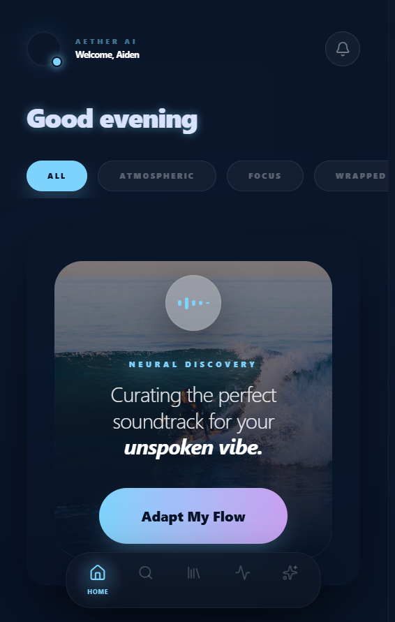
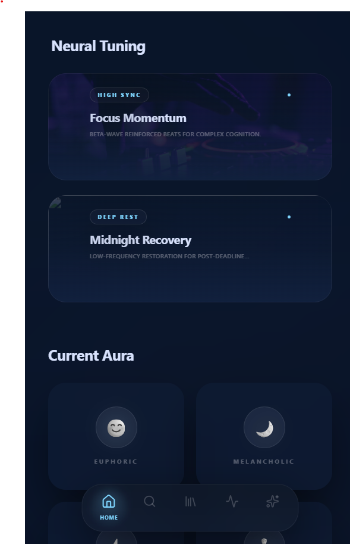
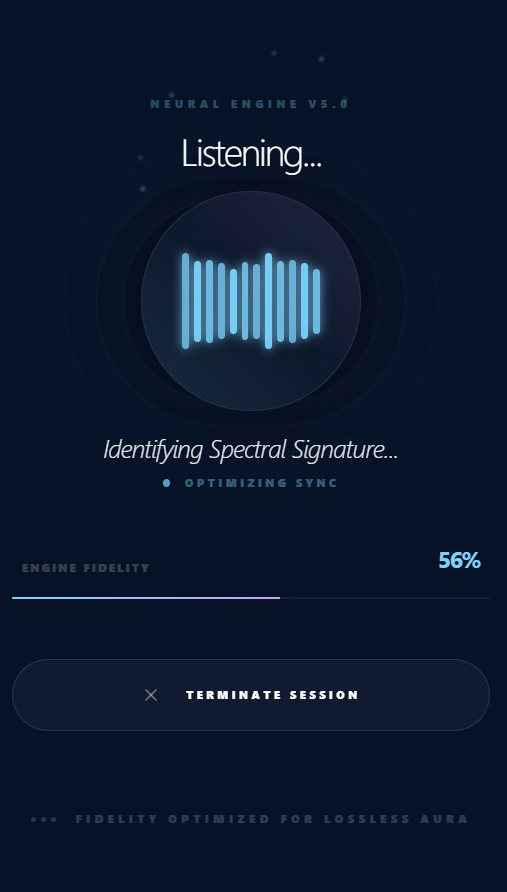
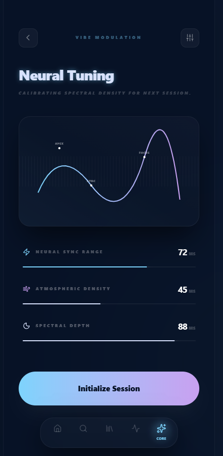
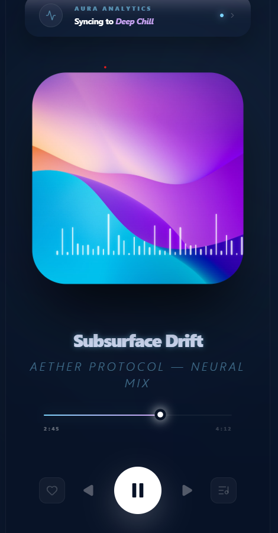
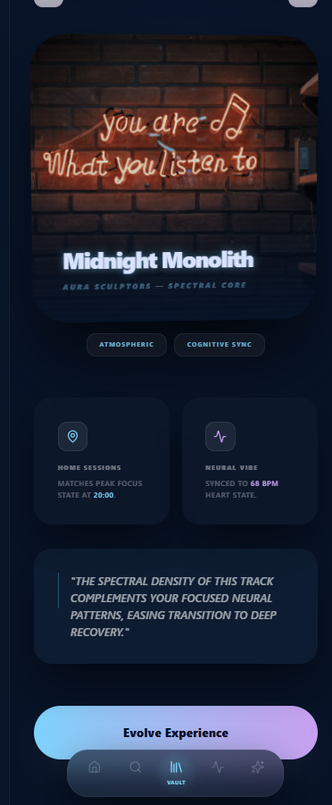

Here’s a Spotify-version README in the SAME polished style and structure as your Swiggy README. Based on the uploaded format/style. 

# 🎵 Heard It + Mood Flow

### AI-Powered Spotify Experience for Emotionally Adaptive Listening

> A futuristic redesign of the Spotify listening experience focused on AI-powered song recognition, emotional music memory, adaptive mood-transition playlists, and cinematic next-generation UI/UX.

---

## ✨ Highlights

* AI-Powered Song Recognition
* Emotional Music Memory System
* Adaptive Mood Transition Playlists
* AI Listening Intelligence
* Repetitive Song Fatigue Control
* Cinematic Spotify UI Redesign
* Immersive Glassmorphism Interface
* Dynamic Mood-Based Music Flow
* Real-Time AI Adaptation
* Advanced Motion & Microinteractions
* Emotionally Intelligent Music Experience
* Premium Futuristic Mobile UI

---

# 🔗 Live Demo

### Frontend

[Open Live App](https://spotify-redesigned.vercel.app)

### GitHub Repository

[Repository](https://github.com/Vaishnavidasyam/spotify-redesigned)

---

# 📌 Table of Contents

1. [Problem Discovery](#1--problem-discovery)
2. [Feature Proposal — Heard It + Mood Flow](#2--feature-proposal--heard-it--mood-flow)
3. [UX Flow + UI](#3--ux-flow--ui)
4. [AI Usage Breakdown](#4--ai-usage-breakdown)
5. [Tech Stack](#5--tech-stack)
6. [Screens Redesigned](#6--screens-redesigned)
7. [Project Screenshots](#7--project-screenshots)
8. [Future Improvements](#8--future-improvements)

---

# 1. 🚨 Problem Discovery

## What Pain Point Did I Identify?

Modern music streaming experiences are highly personalized — but still emotionally disconnected.

Spotify users frequently face three major problems:

---

## 🎧 Problem 1 — Forgetting Songs Heard in Real Life

Users often hear songs in:

* cafés
* Instagram reels
* gyms
* public spaces
* stores
* movies
* social gatherings

But they:

* forget the song later
* lose the emotional moment
* never discover the track again

### Why It Matters

Music experiences are emotional and contextual.

Losing a song means losing:

* the memory
* the mood
* the feeling attached to that moment

---

## 🔁 Problem 2 — Repetitive Music Fatigue

Users frequently experience:

* repetitive recommendations
* playlist fatigue
* hearing the same tracks repeatedly

Even if they still like the song.

Spotify currently lacks a lightweight way to say:

> “I still like this song, just play it less for now.”

---

## 🌊 Problem 3 — Static Listening Sessions

Current playlists:

* don’t evolve naturally
* abruptly change moods
* require manual playlist switching

Example:

```text id="lmn4xz"
Focus Music → Workout → Relaxation
```

Users manually switch playlists multiple times during long listening sessions.

---

## Why Does This Matter?

Music today is:

* emotional
* activity-driven
* long-session based
* highly personalized

Users increasingly expect:

* adaptive experiences
* emotional continuity
* contextual intelligence
* frictionless listening

---

## Who Faces These Problems?

### Primary Users

* Students
* Remote workers
* Gym users
* Commuters
* Casual listeners
* Long-session Spotify users

---

# 2. 💡 Feature Proposal — Heard It + Mood Flow

## What Is the Feature?

**Heard It + Mood Flow** is a next-generation AI ecosystem integrated directly into Spotify.

The feature combines:

* real-world song recognition
* emotional music memory
* adaptive playlist intelligence
* mood-transition listening
* repetition fatigue management

into one seamless premium experience.

---

# 🎧 Heard It — AI Song Recognition

Users can instantly recognize songs heard around them.

Spotify intelligently stores:

* song
* location
* activity
* emotional vibe
* listening environment
* time

### Example

> “Continue this vibe?”

Spotify creates a playlist matching the same emotional atmosphere.

---

# 🌊 Mood Flow — Adaptive Playlist Intelligence

Mood Flow creates AI-generated playlists that evolve dynamically over time.

### Example Flow

```text id="m1vz0y"
Focus → Energetic → Chill → Sleep
```

Instead of static playlists, Spotify intelligently:

* transitions moods gradually
* adapts playlist energy
* reacts to skips and listening behavior
* creates immersive emotional journeys

---

# 🔁 Heard It — Fatigue Control

Users can tap:

## “Heard It”

This temporarily reduces how often a song appears without disliking it.

Spotify learns:

* temporary listening fatigue
* repetition patterns
* diversity preferences

### Benefits

* fresher recommendations
* improved personalization
* reduced repetition
* smarter playlist evolution

---

## Why Would Users Care?

| Before                    | After                          |
| ------------------------- | ------------------------------ |
| Static playlists          | Adaptive emotional playlists   |
| Repetitive songs          | Intelligent fatigue management |
| Lost music moments        | Emotional memory tracking      |
| Manual playlist switching | AI-driven transitions          |
| Generic listening         | Emotionally adaptive listening |

The experience feels:

* smarter
* more emotional
* more immersive
* naturally personalized

---

# 3. 🎨 UX Flow + UI

# Redesigned User Journey

```text id="op9qwx"
Open Spotify
   ↓
Discover “Heard It + Mood Flow”
   ↓
Tap floating recognition button
   ↓
Spotify listens to surrounding audio
   ↓
AI recognizes the song
   ↓
Song memory gets saved
   ↓
Spotify asks:
“Continue this vibe?”
   ↓
AI generates adaptive Mood Flow playlist
   ↓
Playlist evolves dynamically
(Focus → Energetic → Chill → Sleep)
   ↓
User controls repetitive songs with “Heard It”
   ↓
Spotify generates emotional listening insights
```

---

# 🎨 UI/UX Design Direction

The interface was redesigned using:

* futuristic cinematic UI
* glassmorphism
* holographic gradients
* ambient lighting
* floating layered cards
* premium motion systems
* AI-native visual storytelling

Inspired by:

* Spotify concept redesigns
* Apple Vision Pro interfaces
* futuristic AI dashboards
* premium Dribbble showcases

---

# 🎨 Visual Design System

## Color Palette

### Primary Colors

* Accent Blue → `#7DD3FC`
* Secondary Blue → `#88B4CC`
* Purple Accent → `#C8A0F0`

### Background System

* Main Background → `#071226`
* Elevated Surface → `#0B1730`
* Card Surface → `#11203D`

---

# 🖥️ Screens Redesigned

| # | Screen                | Purpose                          |
| - | --------------------- | -------------------------------- |
| 1 | Splash / Intro        | Cinematic Spotify branding       |
| 2 | Discovery Home        | AI-powered music recommendations |
| 3 | Live AI Listening     | Real-time song recognition       |
| 4 | Song Match & Memory   | Emotional memory tracking        |
| 5 | Mood Flow Playlist    | Adaptive AI playlist generation  |
| 6 | Advanced Now Playing  | Immersive listening experience   |
| 7 | Heard It Dashboard    | Repetition fatigue management    |
| 8 | AI Insights Dashboard | Emotional listening analytics    |

---

# 🎧 AI Song Recognition

## Features

* Live audio detection
* Circular waveform visualization
* Real-time AI recognition
* Context-aware memory storage
* Ambient audio-reactive animations

---

# 🌊 Mood Flow Playlist Generation

## Features

* Adaptive mood transitions
* BPM evolution graph
* AI-generated listening flow
* Dynamic playlist adaptation
* Real-time energy balancing

---

# 🔁 Heard It Fatigue System

## Features

* Temporary song cooldown
* Listening fatigue detection
* Diversity recommendations
* Smart repetition management

---

# 🎯 AI Insights Dashboard

## Features

* Emotional heatmaps
* Listening analytics
* Mood evolution tracking
* Adaptive transition summaries
* AI-generated listening insights

---

# ✨ Microinteractions

The redesigned experience includes:

* floating motion effects
* breathing gradients
* waveform reactions
* cinematic transitions
* hover glow feedback
* ambient lighting interactions
* smooth modal animations
* AI-reactive visual effects

---

# ⚠️ Edge Cases Handled

Designed states for:

* no listening history
* weak internet
* offline mode
* low AI confidence
* weak audio input
* repeated mood selection
* unknown song recognition
* empty Heard It library

---

# 🔔 Notification Examples

* “We found your song.”
* “Your Mood Flow playlist is ready.”
* “We’ll play this less for a while.”
* “AI adapted your playlist for focus mode.”

---

# 4. 🤖 AI Usage Breakdown

## How AI Was Used

This project was completed using AI-assisted workflows across:

* product thinking
* UX planning
* UI generation
* motion design
* interaction systems
* prototyping

---

# 🧠 Problem Discovery

AI helped identify:

* repetitive listening fatigue
* emotional playlist gaps
* contextual music discovery problems
* adaptive listening opportunities

---

# 📐 UX Planning

AI assisted with:

* UX flows
* onboarding interactions
* feature prioritization
* adaptive playlist logic
* edge case handling

---

# 🎨 UI Design

AI tools helped:

* generate futuristic UI concepts
* create cinematic design systems
* improve spacing and hierarchy
* refine motion storytelling
* generate advanced visual prompts

---

# 🔄 Prototyping & Iteration

AI helped:

* improve interaction systems
* refine animations
* optimize visual hierarchy
* create premium presentation layouts

---

# 🛠️ AI Tools Used

* Google Stitch AI
* Google AI Studio
* Gemini API
* ChatGPT

---

# ✨ Key Highlights

* AI-powered Spotify redesign
* Adaptive emotional playlists
* Real-world song recognition
* Emotionally immersive UX
* Repetitive-song fatigue control
* Cinematic futuristic UI
* Advanced motion interactions
* AI-assisted UX workflows
* Premium mobile-first experience

---

# 5. 🛠️ Tech Stack

## Frontend

| Tool          | Purpose          |
| ------------- | ---------------- |
| React.js      | UI Architecture  |
| Vite          | Fast Development |
| Tailwind CSS  | Styling          |
| Framer Motion | Animations       |
| React Router  | Navigation       |

---

## AI & Design

| Tool             | Purpose         |
| ---------------- | --------------- |
| Gemini API       | AI Interactions |
| Google Stitch AI | UI Generation   |
| Figma            | UI/UX Design    |
| Framer           | Prototyping     |

---

# 6. 📸 Screens Redesigned

| # | Screen             | Improvement              |
| - | ------------------ | ------------------------ |
| 1 | Splash Screen      | Cinematic branding       |
| 2 | Discovery Home     | AI-powered discovery     |
| 3 | Live Listening     | Immersive recognition    |
| 4 | Song Match         | Emotional memory UX      |
| 5 | Mood Flow          | Adaptive playlist system |
| 6 | Now Playing        | AI-reactive music player |
| 7 | Heard It Dashboard | Fatigue management       |
| 8 | Insights Dashboard | Emotional analytics      |

---

# 7. 📸 Project Screenshots

## 🎵 Discovery Home

          

---

## 🎧 AI Listening Screen



---

## 🌊 Mood Flow Playlist

             

---

## 🎶 Advanced Now Playing



---

## 📊 AI Insights Dashboard



---

# 8. 🚀 Future Improvements

* Real-time ambient mood detection
* Voice-assisted AI playlist generation
* Emotion-based wearable integration
* AI-generated music journaling
* Social mood-sharing experiences
* Smart adaptive workout transitions
* Personalized emotional soundtrack generation

---

# ⚙️ Run Locally

## Clone Repository

```bash id="z7x1kl"
git clone https://github.com/Vaishnavidasyam/spotify-redesigned.git
```

---

## Install Dependencies

```bash id="a9w2rt"
npm install
```

---

## Environment Variables

Create a `.env.local` file:

```env id="c3m8yv"
GEMINI_API_KEY=your_api_key_here
```

---

## Run the App

```bash id="u2q7df"
npm run dev
```

---

# 🚀 Final Outcome

This project demonstrates how AI-assisted workflows can redesign a traditional music streaming experience into:

* a smarter listening ecosystem
* an emotionally adaptive experience
* a cinematic AI-powered interface
* a more immersive personalization system

while maintaining:

* realistic product thinking
* scalable UX design
* launch-ready functionality
* premium next-generation UI/UX

---

# 👩‍💻 Author

## Vaishnavi Dasyam

AI-Assisted Product Design Assessment Submission

---

Built using React, Vite, Tailwind CSS, Framer Motion, Gemini API, Figma, Framer, Google Stitch AI, and AI-assisted UX workflows.
